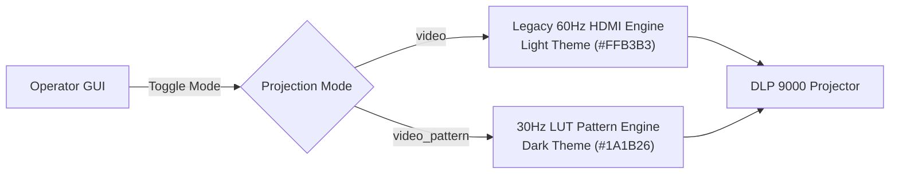

# Prince Unified GUI (`Prince_Segmented_Unified.py`)

## 1. Overview & Purpose

`Prince_Segmented_Unified.py` unifies standard 60 Hz HDMI video printing and 30 Hz HDMI Video Pattern LUT printing into a single cohesive interface for the Prince 3D printer.

Previously, running video pattern projection required switching between two separate, diverging Python scripts (`Prince_Segmented.py` and `Prince_Segmented_VideoPattern.py`). This script brings the **Unified Dual-Mode Architecture** originally developed for Rush into Prince, while preserving Prince's Zaber stage hardware, absolute coordinate conventions, and existing support modules.

> [!NOTE]
> **Zero Disruption**: Both legacy scripts (`Prince_Segmented.py` and `Prince_Segmented_VideoPattern.py`) remain completely intact and functional in the workspace.

---

## 2. Key Features

### 2.1 Dual Projection Mode Switcher
Located in the upper-right control area (`x=800, y=225`), the **Projection Mode** frame provides a one-click toggle between projection engines:

- **Legacy Video Mode (`video`)**:
  - Standard 60 Hz HDMI video projection.
  - Light UI theme: pastel red accent panels (`#FFB3B3`), crisp white inputs, `#834bd0` Prince purple header.
  - Displays a power calibration warning when switching modes.
- **Video Pattern Mode (`video_pattern`)**:
  - 30 Hz HDMI Video Pattern LUT projection with structured exposure sequencing.
  - Dark UI theme: `#1A1B26` window background, `#2E1C1C` dark red panel accents, `#C0CAF5` inputs, `#B794F4` soft purple header.
  - Activates post-print survey logging and experimental conditions management.



### 2.2 Modernized, Clean GUI Layout (Aligned with Rush)
All unnecessary control boxes and clutter that were removed during the Rush printer GUI redesign have also been removed from Prince's unified interface:

1. **Clean Header (No Box Clutter)**:
   - Centered header label placed at `x=620, y=0, anchor='n'`, eliminating the clumsy boxed title frame.
   - Displays bold **Prince** in `#834bd0` (Light Mode) or `#B794F4` (Dark Mode).
   - If `Prince_Logo.png` or `Prince_logo.png` is placed in the root directory, it automatically loads and scales the image logo with zero layout distortion.
2. **Organized Control Stack (Top Right)**:
   - **y=80**: `Image Modification` | `Experimental Conditions`
   - **y=115**: `Sensor Panel (Logging)` | `Sensor Panel (Monitoring)`
   - **y=150**: `Disconnect DLP` | `Reconnect DLP`
   - **y=185**: `Ramped Cylinder`
   - **y=225**: `Projection Mode` frame (`350x95 px`)
   - **y=330**: Checklist (`lbl5`) positioned cleanly below the switcher with **zero overlap**.
3. **Hidden Clutter Boxes**:
   - **Sandwich Mode Frame**: Hidden via `self.frame_sandwich.place_forget()`. All underlying variables (`enable_sandwich_precalib`, `t_sandwich_gap`, etc.) remain instantiated in memory so `SessionManager` state loading never throws attribute errors.
   - **Auto-Home Frame**: Hidden via `self.frame_auto_home.place_forget()`.
   - **Smooth Motion Checkboxes**: Removed from GUI layout (`smoother_retraction_var` and `smooth_lifting_var` remain initialized).
   - **Redundant Buttons**: Removed `b_set_dir`, `b_save_state`, `b_load_state`, and `b_reload_script` (state persistence is handled automatically in the background).
4. **Dynamic Compact Geometry**:
   - Implemented `_apply_recommended_window_geometry()`, which measures placed widgets and sizes the window height to `~680px` (`1200x680+10+10`) with balanced padding, eliminating dead vertical space.

---

## 3. Hardware Architecture & Differences from Rush

While Rush uses an Aerotech Ensemble / A3200 linear stage, Prince operates on a **Zaber** linear stage:

| Feature | Rush (`Rush_Segmented_VideoPattern.py`) | Prince Unified (`Prince_Segmented_Unified.py`) |
|---|---|---|
| **Linear Stage** | Aerotech A3200 / Ensemble | Zaber Motion (`COM3`) |
| **Stage Adapter** | `A3200StageAdapter` | `ZaberStageAdapter` |
| **Stage Acceleration** | A3200 parameter commands | `axis.settings.set("accel", 100000, unit=Units...)` |
| **Accel Check** | Exact readback | Relative tolerance check (`max(100.0, 0.01 * desired)`) |
| **Motion Exception** | Generic driver exception | `MovementFailedException` handling with recovery |
| **Coordinate System** | Machine coordinates | Physical absolute coordinates displayed in `t4` |
| **DLP Projector** | DLP9000 / DLP6500 | DLP9000 (`pycrafter9000.dmd`) |
| **DLP Safe Idle** | Stop sequence, current = 0 | Stop sequence, current = 0 |

### Zaber Acceleration Quantization Tolerance
Setting the Zaber stage to `100,000 µm/s²` (`100 mm/s²`) reads back as `99,921.23 µm/s²` due to integer microstep math in firmware. The readback validation accommodates this:

```python
if abs(current_accel_val_after - desired_startup_accel_physical_ums2) > max(100.0, 0.01 * desired_startup_accel_physical_ums2):
    self.update_status_message(f"WARNING: Readback acceleration differs...", error=True)
```

### Physical Absolute Coordinate System
In earlier VideoPattern experiments, `t4` displayed relative position (`abs - ref`), while `goto_position()` expected absolute coordinates, risking head collisions. In `Prince_Segmented_Unified.py`:
- `get_position()` queries `self.axis.get_position(Units.LENGTH_MILLIMETRES)` directly and writes the absolute physical coordinate into `t4`.
- `set_home()` records `self.reference = self.axis.get_position(Units.LENGTH_MILLIMETRES)`.
- `goto_position()`, `moveup()`, and `movedown()` strictly operate on physical stage coordinates.

---

## 4. Thread-Safe Post-Print Workflow

To prevent cross-thread Tkinter crashes when worker threads complete prints:

1. **Queue Dispatch**: Worker thread enqueues the post-print event into `self._post_print_queue.put(('open_dialog', status_to_write))`.
2. **Main-Thread Poller**: `self._poll_post_print_queue()` runs every 500 ms on the Tkinter main loop to pop events and spawn dialogs safely on the main thread.
3. **Prince Survey Dialog**: Uses Prince's existing, working [`LoggingCheckWindow_VideoPattern.py`](file:///C:/Users/cheng%20sun/BoyuanSun/Prince_CurrentWorkingVersion/support_modules/LoggingCheckWindow_VideoPattern.py) (kept unmodified).
4. **Execution Guard**: Includes a closure guard (`handled = [False]`) ensuring dialog save/close or dismissal executes `on_post_print_dialog_closed` exactly once.

---

## 5. Dual Sensor Panels (Logging vs Monitoring)

Prince Unified includes dedicated buttons for both sensor workflows:
- **Sensor Panel (Logging)**: Standard logging and force gauge calibration.
- **Sensor Panel (Monitoring)**: Extended continuous monitoring window.
- **Mutual Exclusion**: `_sync_sensor_panel_button_states()` disables the alternate button when one window is active, preventing device access collisions.

---

## 6. Session Persistence (`SessionManager.py`)

`support_modules/SessionManager.py` has been updated to serialize and restore:
- `projection_mode` ("video" or "video_pattern").
- Automatically triggers `_on_projection_mode_change()` during autoload to restore themes.
- Validates image folder paths and instruction files before attempting directory loads on startup, preventing modal error alerts.

---

## 7. How to Run & Verify

### 7.1 Running the Unified Application

> [!IMPORTANT]
> Ensure no other instance of Prince is running to prevent `SerialPortBusyException` on `COM3`.

```powershell
python Prince_Segmented_Unified.py
```

### 7.2 Verification Steps
1. **Startup Check**: Confirm stage homing on `COM3` and default acceleration setting without warnings.
2. **Mode Switcher Check**: Click the **Enable Video Pattern Mode (Newer)** checkbox:
   - UI should transition to Dark theme.
   - Header title should shift from `#834bd0` to `#B794F4`.
   - Switching back should restore Light theme without visual artifacts.
3. **Motion Check**: Press **Get Position** to ensure `t4` populates with absolute millimeters.
4. **Sensor Panels**: Test opening `Sensor Panel (Logging)` and confirm `Sensor Panel (Monitoring)` is safely disabled while open.
